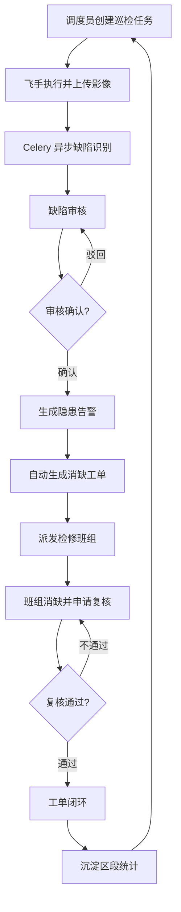

# 山区输电线路无人机巡检缺陷识别与工单闭环平台 — 产品需求文档（PRD）

## 1. 产品概述

面向山区输电线路运维场景的无人机巡检数字化平台，解决人工巡检风险高、缺陷发现滞后、消缺工单流转低效、故障区段缺乏数据沉淀等问题。平台将线路地图建模、无人机航线、AI 缺陷识别、隐患告警、影像回放、消缺工单闭环与高发故障区段统计贯通为一条数据闭环，目标用户为电网运检调度员、无人机飞手、缺陷审核员、检修班组。

产品价值：将单次巡检"发现—识别—告警—派单—消缺—复核"全流程在线化、可追溯，并通过 PostGIS 空间聚合沉淀高发故障区段，指导线路通道治理与无人机巡检策略优化。

## 2. 核心功能

### 2.1 用户角色

| 角色 | 注册/开通方式 | 核心权限 |
|------|--------------|---------|
| 调度管理员 | 管理员后台开通 | 全量权限，线路/航线/无人机建模，统计分析，工单督办 |
| 无人机飞手 | 管理员开通 | 接收巡检任务、上传巡检影像、查看航线 |
| 缺陷审核员 | 管理员开通 | 审核 AI 识别缺陷、确认/驳回、触发告警与派单 |
| 检修班组 | 管理员开通 | 接收消缺工单、填写消缺记录、申请复核 |

### 2.2 功能模块

1. **总览大屏**：线路/杆塔/无人机在线状态、当日巡检进度、缺陷与告警统计、地图热力
2. **线路地图建模**：PostGIS 线路与杆塔空间建模、杆塔定位、通道走廊可视化
3. **无人机航线管理**：航线航点编辑、航线与杆塔关联、航线复用与下发
4. **巡检任务**：基于航线创建任务、绑定无人机与飞手、任务状态流转
5. **缺陷识别**：绝缘子破损/串歪斜、塔体锈蚀/螺栓缺失等 AI 识别结果审核
6. **隐患告警**：按缺陷严重度自动告警，告警中心列表与处置
7. **巡检影像回放**：按任务/杆塔回放巡检影像，标注缺陷框
8. **消缺工单**：工单创建/派发/接单/消缺/复核闭环流转
9. **高发故障区段统计分析**：按区段聚合缺陷频次，热力图与趋势

### 2.3 页面详情

| 页面名称 | 模块名称 | 功能描述 |
|---------|---------|---------|
| 登录页 | 账号登录 | 角色账号登录，按角色跳转默认首页 |
| 总览大屏 | KPI 卡片 | 线路/杆塔/无人机/今日巡检/缺陷/告警计数 |
| 总览大屏 | 空间地图 | 线路、杆塔、告警点叠加，告警闪烁 |
| 总览大屏 | 实时动态 | 最近缺陷识别、工单流转滚动 |
| 线路地图建模 | 线路树 | 线路—区段—杆塔层级树 |
| 线路地图建模 | 空间编辑 | 地图绘制线路走廊、新增/拖动杆塔 |
| 航线管理 | 航线列表 | 航线名称、关联线路、航点数、状态 |
| 航线管理 | 航点编辑 | 地图点选航点、高度/速度参数、预览 |
| 巡检任务 | 任务列表 | 任务编号、航线、无人机、飞手、状态、进度 |
| 巡检任务 | 任务详情 | 航线执行轨迹、已采集影像数 |
| 缺陷识别 | 缺陷列表 | 缺陷类型、严重度、杆塔、状态、缩略图 |
| 缺陷识别 | 识别详情 | 影像大图、缺陷框、AI 置信度、审核操作 |
| 隐患告警 | 告警中心 | 告警级别筛选、定位、关联缺陷/工单 |
| 影像回放 | 影像时间轴 | 按杆塔/时间轴浏览巡检影像 |
| 影像回放 | 缺陷标注 | 影像上叠加缺陷框与类型标签 |
| 消缺工单 | 工单列表 | 工单编号、缺陷来源、状态、责任人 |
| 消缺工单 | 工单详情 | 流转时间线、消缺记录、复核结果 |
| 统计分析 | 区段热力 | 高发故障区段排名、地图热力 |
| 统计分析 | 趋势分析 | 缺陷类型/时间趋势、消缺闭环率 |

## 3. 核心流程

主流程：调度员基于线路与航线创建巡检任务 → 飞手执行并上传巡检影像 → Celery 异步触发 AI 缺陷识别 → 识别结果进入审核 → 审核员确认缺陷并按严重度生成告警 → 自动生成消缺工单并派发 → 检修班组消缺并申请复核 → 复核通过闭环；同时缺陷空间数据持续沉淀用于高发故障区段统计。

## 4. 用户界面设计

### 4.1 设计风格

- **风格定位**：工业控制室 / 电网监控大屏美学。深色科技底，强调空间数据与告警可读性，工业精密感。
- **主色调**：石墨深底（#0B0F14 / #11161D），配电光青（#22D3EE）为主交互色，能量琥珀（#F5B301）为次强调，告警红（#FF4D4F）/警示橙（#FF8A00）/正常绿（#3DD68C）用于状态语义。
- **按钮风格**：扁平+1px 描边+微弱内发光，主按钮青色实底，次按钮描边，危险操作红色。
- **字体**：标题用 `Orbitron` / `Saira`（工业几何感），正文用 `IBM Plex Sans`，数据数字用 `JetBrains Mono`。
- **布局风格**：左侧固定导航 + 顶部状态栏 + 主内容区，地图类页面采用全幅地图+浮动面板。
- **图标**：lucide-react 线性图标，地图标记用语义色填充。

### 4.2 页面设计概览

| 页面名称 | 模块名称 | UI 元素 |
|---------|---------|---------|
| 总览大屏 | KPI 卡片 | 深色卡片、青色高亮数字、悬浮发光描边 |
| 总览大屏 | 空间地图 | 全幅深色底图、线路青色、杆塔圆点、告警红色脉冲 |
| 线路地图建模 | 空间编辑 | 浮动工具面板、可拖动杆塔、走廊半透明带 |
| 缺陷识别 | 识别详情 | 影像大图、青色缺陷框、置信度进度条、审核按钮组 |
| 消缺工单 | 工单详情 | 左右分栏、垂直流转时间线、状态色徽标 |
| 统计分析 | 区段热力 | 地图热力叠加、右侧排名条形图、底部趋势折线 |

### 4.3 响应式

桌面优先（1920/1440 设计基准），适配 1280 及以上；地图与统计页保留全幅体验，列表页在窄屏折叠侧栏。移动端仅做只读查看。

### 4.4 3D 场景指引（可选增强）

本平台以 2D 地图+空间数据为主，3D 为可选增强：可在杆塔详情中以 three.js 呈现杆塔与缺陷点位三维示意，环境采用雾化深色天空，主光为冷色平行光，相机环绕巡视。非 MVP 必需。
