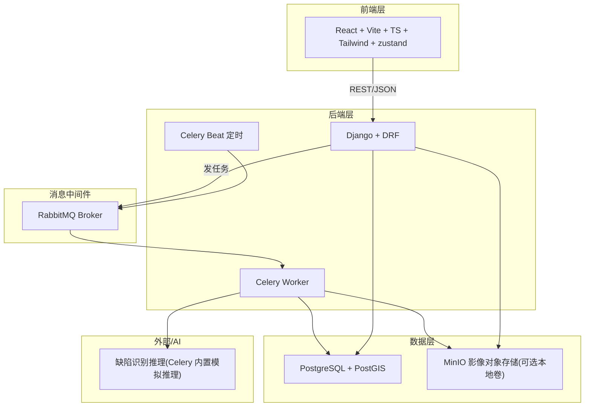
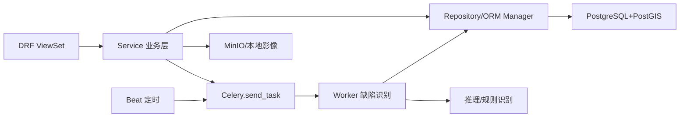

# 山区输电线路无人机巡检缺陷识别与工单闭环平台 — 技术架构文档

## 1. 架构设计



## 2. 技术说明

- **前端**：React@18 + TypeScript + Vite + TailwindCSS + zustand + react-router-dom + leaflet（地图）+ recharts（图表）+ lucide-react（图标）
- **后端**：Django@4 + Django REST Framework + django-cors-headers + geojson 序列化
- **空间数据库**：PostgreSQL@15 + PostGIS 扩展，存储线路 LineString、杆塔 Point、航线航点
- **异步任务**：Celery + RabbitMQ Broker，用于巡检影像缺陷识别、告警生成、定时统计
- **部署**：Docker Compose 一键编排（postgres-postgis、rabbitmq、django-api、celery-worker、celery-beat、frontend vite 预览/构建产物）
- **初始化**：后端 Django 管理命令初始化示例线路/杆塔/无人机/账号；前端 `pnpm create vite-init` 初始化

## 3. 路由定义（前端）

| 路由 | 用途 |
|------|------|
| /login | 登录页 |
| / | 总览大屏 |
| /lines | 线路地图建模 |
| /routes | 无人机航线管理 |
| /tasks | 巡检任务列表 |
| /tasks/:id | 巡检任务详情 |
| /defects | 缺陷识别列表 |
| /defects/:id | 缺陷识别详情 |
| /alerts | 隐患告警中心 |
| /replay | 巡检影像回放 |
| /workorders | 消缺工单列表 |
| /workorders/:id | 消缺工单详情 |
| /analytics | 高发故障区段统计分析 |

## 4. API 定义（DRF）

采用 JWT（SimpleJWT）鉴权，统一前缀 `/api`。核心资源：

```ts
// 认证
POST /api/auth/login/      // {username,password} -> {access,refresh,role}
POST /api/auth/refresh/

// 线路/杆塔（空间）
GET  /api/lines/          // 列表，含 GeoJSON geometry
POST /api/lines/           // 创建线路(LineString)
GET  /api/towers/          // 杆塔列表(Point)，支持line过滤
POST /api/towers/          // 新增杆塔(经纬度)

// 航线
GET  /api/flight-routes/   // 航线列表
POST /api/flight-routes/   // 创建航线+航点waypoints[]

// 巡检任务
GET  /api/tasks/           // 任务列表
POST /api/tasks/           // 创建任务(route,drone,pilot)
POST /api/tasks/:id/upload/ // 上传巡检影像(触发Celery识别)

// 缺陷
GET  /api/defects/         // 缺陷列表(支持type/severity/status过滤)
POST /api/defects/:id/review/ // {action:confirm|reject,note}

// 告警
GET  /api/alerts/          // 告警列表
POST /api/alerts/:id/handle/ // 处置告警

// 工单
GET  /api/workorders/      // 工单列表
POST /api/workorders/       // 手动创建工单
POST /api/workorders/:id/transition/ // {action:assign|start|finish|review,note}

// 影像回放
GET  /api/media/?task=&tower= // 巡检影像列表

// 统计
GET  /api/stats/sections/   // 高发故障区段聚合(GeoJSON+排名)
GET  /api/stats/trends/     // 缺陷类型/时间趋势
GET  /api/stats/overview/   // 大屏KPI
```

缺陷/告警/工单响应片段：

```ts
interface Defect {
  id: number; type: 'insulator'|'tower'; subtype: string;
  severity: 'critical'|'major'|'minor'; status: 'pending'|'confirmed'|'rejected';
  tower_id: number; media_id: number; bbox: [number,number,number,number];
  confidence: number; created_at: string;
}
interface Alert { id: number; level: 'critical'|'major'|'minor'; defect_id: number; status: 'open'|'handled'; }
interface WorkOrder {
  id: number; defect_id: number; status: 'created'|'assigned'|'doing'|'review'|'closed';
  assignee: string; logs: {action:string;operator:string;note:string;at:string}[];
}
```

## 5. 服务架构图



## 6. 数据模型

### 6.1 数据模型定义（ER）

```mermaid
erDiagram
    USER ||--o{ TASK : "pilot"
    LINE ||--o{ SECTION : "has"
    LINE ||--o{ TOWER : "contains"
    SECTION ||--o{ TOWER : "groups"
    FLIGHT_ROUTE ||--o{ TASK : "used_by"
    DRONE ||--o{ TASK : "executes"
    TASK ||--o{ MEDIA : "produces"
    MEDIA ||--o{ DEFECT : "detected"
    TOWER ||--o{ DEFECT : "located_at"
    DEFECT ||--o|| ALERT : "raises"
    DEFECT ||--o|| WORKORDER : "creates"
    WORKORDER ||--o{ WORKORDER_LOG : "logs"
    USER ||--o{ WORKORDER : "assignee"
```

核心模型字段：

- **User**：id, username, password, role(admin/pilot/reviewer/crew), name
- **Line**：id, name, voltage, geom(LineString, SRID=4326), created_at
- **Section**：id, line(FK), name, start_km, end_km
- **Tower**：id, line(FK), section(FK), code, geom(Point), height, type
- **FlightRoute**：id, name, line(FK), waypoints(LineString/JSON), altitude, speed, status
- **Drone**：id, name, model, status(idle/busy/offline), battery
- **Task**：id, code, route(FK), drone(FK), pilot(FK), status(pending/running/done), started_at, ended_at
- **Media**：id, task(FK), tower(FK), url, type(image/video), captured_at, geom(Point)
- **Defect**：id, media(FK), tower(FK), type(insulator/tower), subtype, severity, status, bbox, confidence, created_at
- **Alert**：id, defect(FK), level, status(open/handled), created_at
- **WorkOrder**：id, defect(FK), assignee(FK), status(created/assigned/doing/review/closed), created_at
- **WorkOrderLog**：id, workorder(FK), action, operator, note, at

### 6.2 数据定义语言（DDL 关键表，PostGIS）

```sql
CREATE EXTENSION IF NOT EXISTS postgis;

CREATE TABLE lines_line (
  id BIGSERIAL PRIMARY KEY,
  name VARCHAR(120) NOT NULL,
  voltage VARCHAR(20),
  geom geometry(LineString,4326) NOT NULL,
  created_at TIMESTAMPTZ DEFAULT now()
);
CREATE INDEX idx_line_geom ON lines_line USING GIST (geom);

CREATE TABLE lines_tower (
  id BIGSERIAL PRIMARY KEY,
  line_id BIGINT REFERENCES lines_line(id),
  section_id BIGINT,
  code VARCHAR(60) NOT NULL,
  geom geometry(Point,4326) NOT NULL,
  height NUMERIC(6,2),
  type VARCHAR(40),
  created_at TIMESTAMPTZ DEFAULT now()
);
CREATE INDEX idx_tower_geom ON lines_tower USING GIST (geom);

CREATE TABLE inspection_flightroute (
  id BIGSERIAL PRIMARY KEY,
  name VARCHAR(120) NOT NULL,
  line_id BIGINT REFERENCES lines_line(id),
  waypoints geometry(LineString,4326),
  altitude NUMERIC(6,1),
  speed NUMERIC(5,1),
  status VARCHAR(20) DEFAULT 'draft'
);

CREATE TABLE inspection_defect (
  id BIGSERIAL PRIMARY KEY,
  media_id BIGINT NOT NULL,
  tower_id BIGINT NOT NULL,
  type VARCHAR(20) NOT NULL,
  subtype VARCHAR(60),
  severity VARCHAR(10) NOT NULL,
  status VARCHAR(12) DEFAULT 'pending',
  bbox JSONB,
  confidence NUMERIC(5,2),
  created_at TIMESTAMPTZ DEFAULT now()
);
CREATE INDEX idx_defect_tower ON inspection_defect(tower_id);
CREATE INDEX idx_defect_severity ON inspection_defect(severity);

CREATE TABLE ops_workorder (
  id BIGSERIAL PRIMARY KEY,
  defect_id BIGINT NOT NULL,
  assignee_id BIGINT,
  status VARCHAR(12) DEFAULT 'created',
  created_at TIMESTAMPTZ DEFAULT now(),
  closed_at TIMESTAMPTZ
);

-- 高发故障区段统计视图：按线段聚合缺陷频次
CREATE VIEW stats_section_defect AS
SELECT l.id AS line_id, l.name AS line_name,
       COUNT(d.id) AS defect_count,
       SUM(CASE WHEN d.severity='critical' THEN 1 ELSE 0 END) AS critical_count
FROM lines_line l
JOIN lines_tower t ON t.line_id=l.id
LEFT JOIN inspection_defect d ON d.tower_id=t.id
GROUP BY l.id, l.name;
```

## 7. 部署（Docker Compose）

- 服务：`db`(postgis) / `rabbitmq` / `api`(django,gunicorn或runserver) / `worker`(celery) / `beat`(celery beat) / `frontend`(vite dev 或 nginx 静态)
- 数据卷：`pgdata`、`rabbitmq_data`、`media_data`（巡检影像本地卷）
- 初始化：`docker compose exec api python manage.py migrate && python manage.py init_demo`
- 前端通过 Vite proxy 将 `/api` 转发至 `api` 服务
